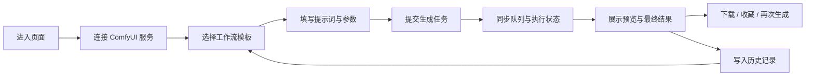

## 1. 产品概述
这是一个面向 ComfyUI 工作流调用场景的前端交互页面，帮助设计师、提示词工程师和内容团队以更低门槛完成图像生成、参数调整、任务跟踪与结果管理。
- 主要解决 ComfyUI 原生节点界面学习成本高、流程切换繁琐、结果回看与对比效率低的问题，提供更直观、易上手且具备实时反馈的工作台体验。
- 产品目标是形成一个兼顾展示感与生产力的生成式创作入口，既适合日常出图，也适合作为业务系统中的 AI 生成中台前端。

## 2. 核心功能

### 2.1 用户角色
| 角色 | 接入方式 | 核心权限 |
|------|----------|----------|
| 普通创作者 | 连接 ComfyUI 服务地址 | 选择工作流、填写提示词、调节参数、提交任务、查看历史结果 |
| 高级操作员 | 连接 ComfyUI 服务地址并启用高级面板 | 管理工作流模板、查看节点映射、调试任务输入输出、复用历史参数 |

### 2.2 功能模块
1. **生成工作台页面**：工作流选择、提示词编辑、参数控制、任务提交、状态监控、结果预览。
2. **历史与素材页面**：历史任务列表、图片对比、收藏标记、结果复用、导出下载。
3. **系统配置抽屉**：ComfyUI 服务连接、预设切换、界面密度调整、主题和交互偏好设置。

### 2.3 页面详情
| 页面名称 | 模块名称 | 功能描述 |
|-----------|-----------|-----------|
| 生成工作台 | 顶部导航区 | 展示品牌标题、当前连接状态、快速入口、主题切换和系统配置入口 |
| 生成工作台 | 工作流卡片区 | 展示常用工作流模板，支持封面、标签、简介、最近使用、收藏与一键应用 |
| 生成工作台 | 提示词输入区 | 支持正向提示词、反向提示词、常用片段快捷插入、字数统计、提示词模板复用 |
| 生成工作台 | 参数控制区 | 支持模型、分辨率、采样器、步数、CFG、种子、批量数量等核心参数调整 |
| 生成工作台 | 高级映射区 | 支持将表单字段映射到 ComfyUI 指定节点输入，支持折叠、重置、参数联动 |
| 生成工作台 | 队列状态区 | 展示提交中、排队中、生成中、完成、失败等状态，并显示耗时和进度反馈 |
| 生成工作台 | 结果预览区 | 支持实时缩略图、完成图大图预览、前后对比、局部放大、下载与再次生成 |
| 历史与素材 | 历史记录列表 | 按时间、工作流、状态筛选任务，支持搜索提示词和重新载入参数 |
| 历史与素材 | 图片对比面板 | 支持双图或多图对比，查看不同参数组合带来的差异 |
| 历史与素材 | 收藏与导出区 | 支持收藏、批量下载、复制提示词、复制参数 JSON |
| 系统配置抽屉 | 连接设置 | 配置 ComfyUI API 地址、WebSocket 地址、连接检测和重试 |
| 系统配置抽屉 | 偏好设置 | 设置主题风格、默认工作流、默认参数、自动滚动与通知方式 |

## 3. 核心流程
用户进入页面后，先连接 ComfyUI 服务，随后在工作流卡片区选择适合的生成模板。页面自动加载对应参数表单与默认值，用户填写提示词、选择模型和核心参数后提交任务。任务进入 ComfyUI 队列后，前端通过轮询或 WebSocket 持续同步执行状态，并在右侧结果区展示实时反馈。生成完成后，用户可直接预览、下载、收藏，或将本次参数一键回填后再次生成。

历史页面承接复用场景。用户可以根据时间、工作流和关键词筛选既往记录，将历史结果重新载入工作台继续迭代，减少重复输入，形成连续创作闭环。

## 4. 用户界面设计
### 4.1 设计风格
- 主色采用深石墨黑、蓝绿霓光和暖橙强调色，形成带有“专业创作台”气质的暗色视觉系统。
- 按钮风格以大圆角、微发光描边和层级阴影为主，主操作按钮突出，次操作按钮保持克制。
- 字体采用高识别度标题字体搭配清晰的正文无衬线字体，强调工作台的现代感与易读性。
- 布局采用桌面优先的三栏工作台结构：左侧流程与模板，中部参数与输入，右侧预览与历史联动。
- 图标建议使用线性图标配合少量状态色点缀，避免复杂拟物，保持专业、清爽、科技感。

### 4.2 页面设计概览
| 页面名称 | 模块名称 | UI 元素 |
|-----------|-----------|----------|
| 生成工作台 | 顶部导航区 | 半透明浮层导航、连接状态胶囊、渐变高亮按钮、轻微模糊背景 |
| 生成工作台 | 工作流卡片区 | 可横向滚动卡片、封面预览、标签角标、悬停放大、收藏动效 |
| 生成工作台 | 提示词输入区 | 深色输入面板、分组标题、快捷插入芯片、输入聚焦光晕 |
| 生成工作台 | 参数控制区 | 分段滑块、数字输入框、切换按钮、折叠分组、重置入口 |
| 生成工作台 | 队列状态区 | 时间轴、状态标签、环形进度、任务卡片、错误提示横幅 |
| 生成工作台 | 结果预览区 | 大图预览、网格缩略图、全屏查看、悬停工具栏、下载按钮 |
| 历史与素材 | 历史记录列表 | 卡片列表、筛选条、状态徽标、时间信息、快速复用按钮 |
| 历史与素材 | 图片对比面板 | 并排对比、拖拽分割线、参数差异标签、焦点放大层 |
| 系统配置抽屉 | 配置面板 | 抽屉式布局、分组表单、连接检测按钮、保存成功反馈 |

### 4.3 响应式设计
采用桌面优先策略，在大屏下保持完整三栏创作台结构；平板端压缩为上下分区；移动端将工作流、参数、预览改为分段切换，保证核心操作仍能完成。对按钮尺寸、拖拽区域和抽屉展开方式进行触控优化，确保操作简单直接。
