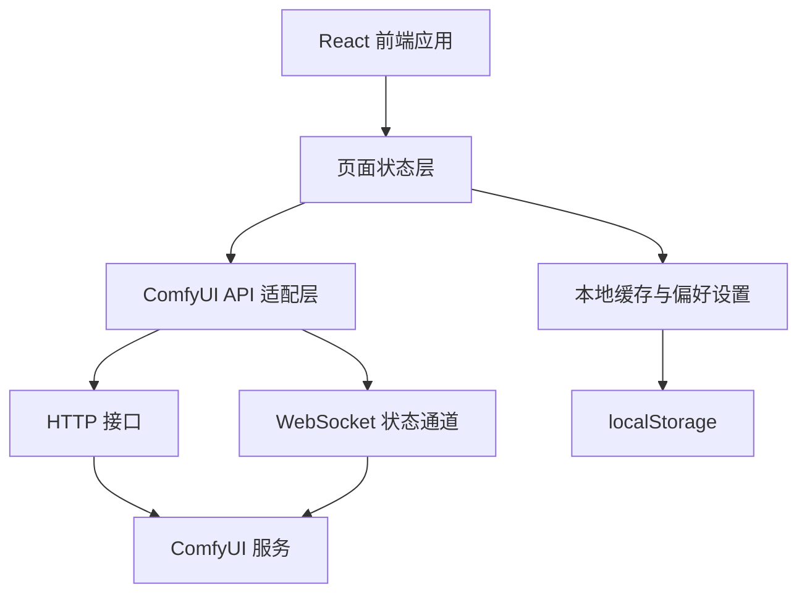
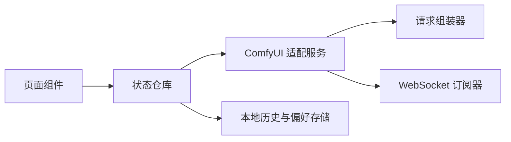
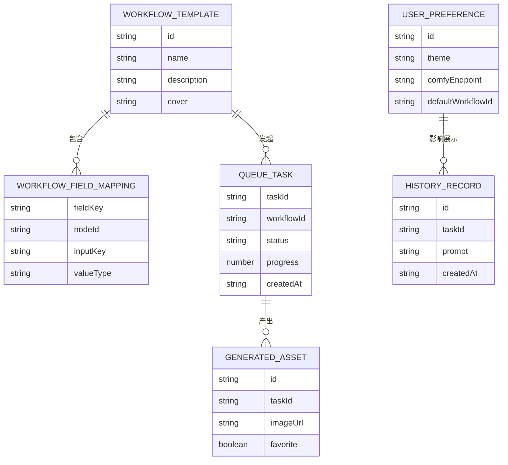

## 1. 架构设计


## 2. 技术说明
- 前端：React 18 + TypeScript + Vite
- 样式：Tailwind CSS 3 + CSS Variables，用于主题、色板和层级阴影统一管理
- 状态管理：Zustand，用于工作流、表单、队列状态、历史记录和系统配置管理
- 数据请求：原生 `fetch` 封装 + WebSocket，用于 ComfyUI 接口调用和执行状态实时同步
- 图表与动效：Framer Motion，用于面板过渡、卡片悬停、结果反馈动画
- 本地持久化：localStorage，用于保存最近连接、默认工作流、主题和常用提示词片段
- 后端：无独立业务后端，直接对接 ComfyUI 提供的 HTTP / WebSocket 服务
- 数据来源：ComfyUI 实时接口 + 前端本地缓存的历史数据与收藏数据

## 3. 路由定义
| 路由 | 用途 |
|------|------|
| / | 生成工作台首页，承载工作流选择、参数配置、任务提交与结果预览 |
| /history | 历史与素材页面，查看历史任务、对比图片、复用参数 |

## 4. API 定义
前端对接 ComfyUI 时采用适配层封装，避免页面组件直接依赖接口细节。以下为建议使用的数据结构与接口约定。

```ts
type WorkflowTemplate = {
  id: string;
  name: string;
  description: string;
  cover: string;
  tags: string[];
  workflowJson: Record<string, unknown>;
  fieldMappings: WorkflowFieldMapping[];
};

type WorkflowFieldMapping = {
  fieldKey: string;
  nodeId: string;
  inputKey: string;
  valueType: "string" | "number" | "boolean";
};

type GenerationForm = {
  prompt: string;
  negativePrompt: string;
  model: string;
  width: number;
  height: number;
  steps: number;
  cfg: number;
  sampler: string;
  seed: number | null;
  batchSize: number;
};

type QueueTask = {
  taskId: string;
  workflowId: string;
  status: "idle" | "queued" | "running" | "success" | "error";
  progress: number;
  createdAt: string;
  updatedAt: string;
  previewImages: string[];
  finalImages: string[];
  errorMessage?: string;
};
```

建议接口封装：

| 接口名称 | 方法 | 用途 |
|----------|------|------|
| `/api/system/stats` | GET | 读取 ComfyUI 系统信息、队列状态、可用模型列表 |
| `/api/workflows` | GET | 读取前端内置或本地维护的工作流模板列表 |
| `/api/generate` | POST | 根据表单参数和映射规则组装 prompt 并提交到 ComfyUI |
| `/api/tasks/:id` | GET | 获取单个任务当前状态与结果 |
| `/api/history` | GET | 从本地缓存或扩展存储中读取历史任务 |

说明：实际落地时，可在前端适配层中将以上语义接口映射为 ComfyUI 原生端点，如 `/prompt`、`/history`、`/view` 和 WebSocket 消息通道。

## 5. 服务架构图
当前方案不引入独立业务后端，因此不需要传统 Controller / Service / Repository 结构。前端内部建议按以下模块拆分：



## 6. 数据模型
### 6.1 数据模型定义


### 6.2 数据定义语言
该项目默认以前端本地缓存为主，不强依赖数据库。若未来需要持久化，可采用 IndexedDB 或 SQLite，对应表结构建议如下：

```sql
CREATE TABLE workflow_templates (
  id TEXT PRIMARY KEY,
  name TEXT NOT NULL,
  description TEXT,
  cover TEXT,
  tags TEXT,
  workflow_json TEXT NOT NULL
);

CREATE TABLE history_records (
  id TEXT PRIMARY KEY,
  task_id TEXT NOT NULL,
  workflow_id TEXT NOT NULL,
  prompt TEXT,
  negative_prompt TEXT,
  params_json TEXT NOT NULL,
  created_at TEXT NOT NULL
);

CREATE TABLE generated_assets (
  id TEXT PRIMARY KEY,
  task_id TEXT NOT NULL,
  image_url TEXT NOT NULL,
  favorite INTEGER DEFAULT 0
);

CREATE INDEX idx_history_created_at ON history_records(created_at);
CREATE INDEX idx_generated_assets_task_id ON generated_assets(task_id);
```
